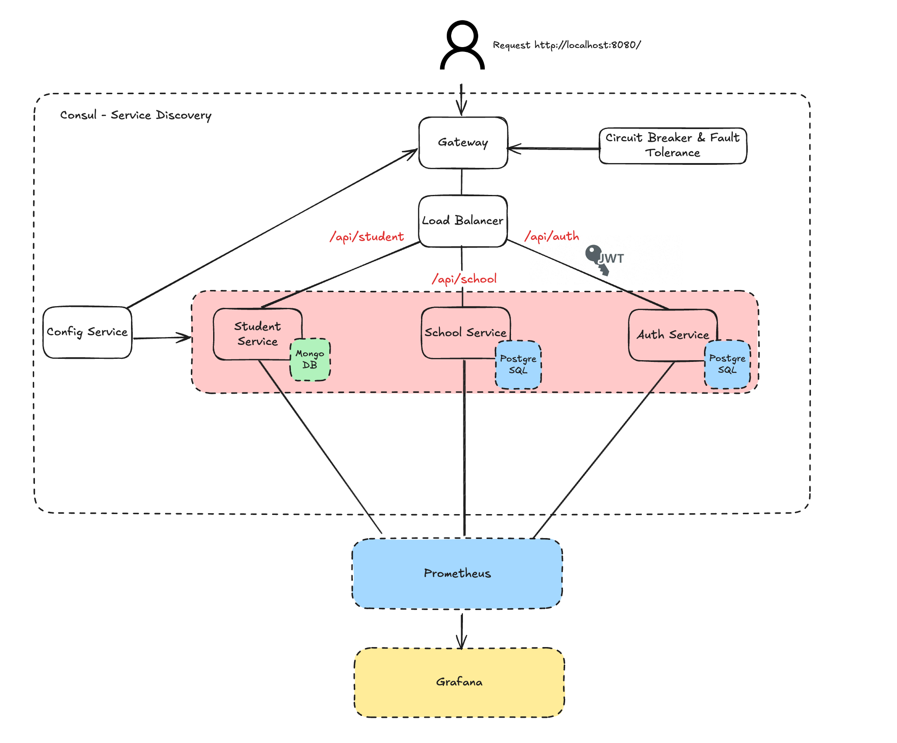
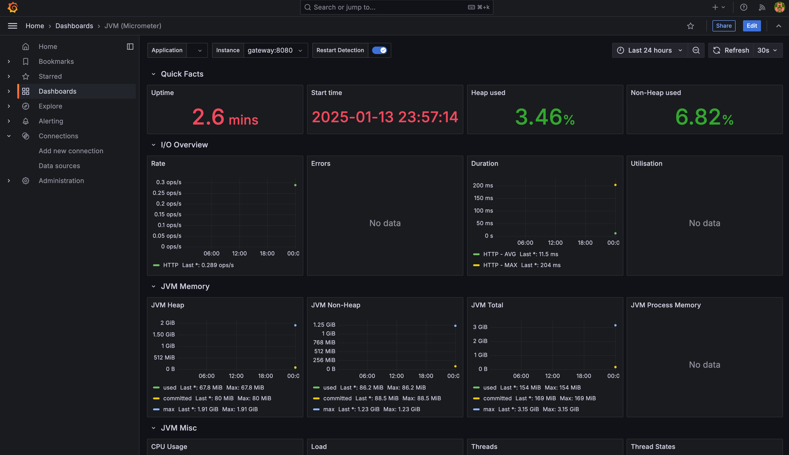
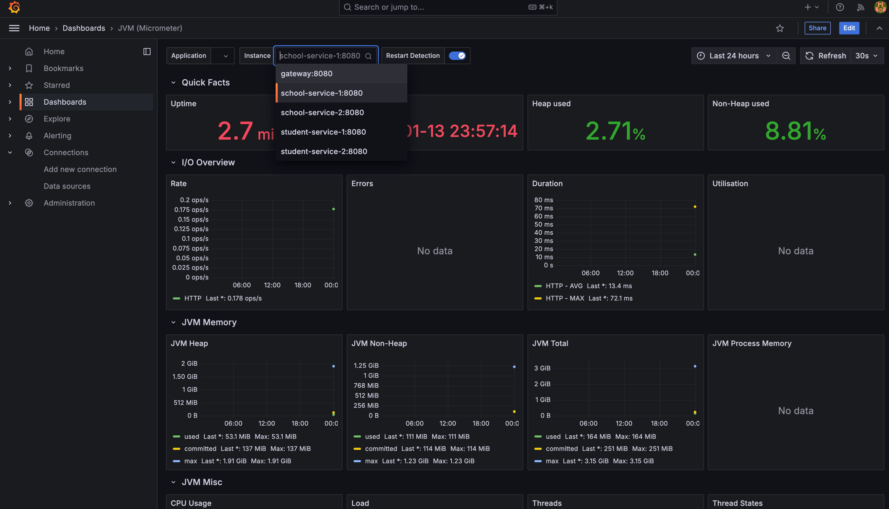

# 🎓 School Project Microservices

> Microservices project for school, using Spring Boot, Consul, Grafana, Prometheus and Docker.

## 🚀 Architecture

# 🚧 Installation

### ⚙️ Local

- `brew install consul`
- `consul agent -dev`
- start all services (gateway, school, student)

### 🐳 Docker

- `make build` or `make no-cache`
- `make up`
- ➡️`http://localhost:8080/api/`

# 🧩 Features 

- [x] Service Discovery (Consul)
- [x] Load Balancing (Spring Cloud Loadbalancer)
- [x] Circuit Breaker (Resilience4j)
- [x] Gateway (Spring Cloud Gateway)
- [x] Monitoring and Logging (Prometheus, Grafana)
- [x] Configuration Management (Spring Cloud Config)

# 🚀 Grafana Dashboard (id: 4701)

### 🌐 Gateway Panel

### 💻 Service Panel

