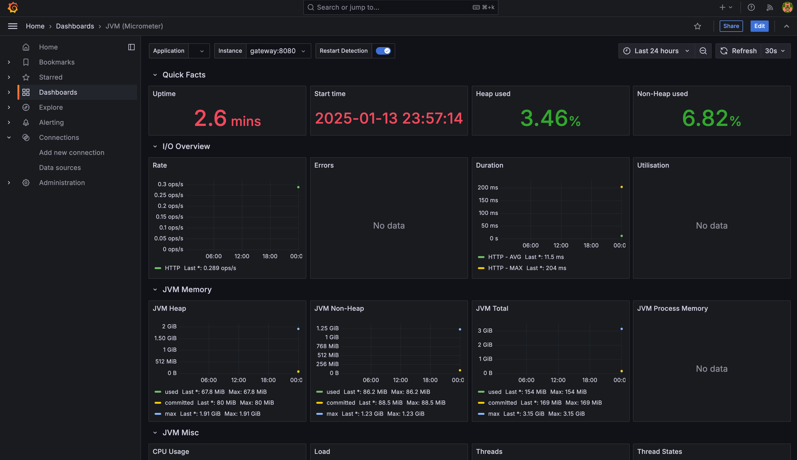
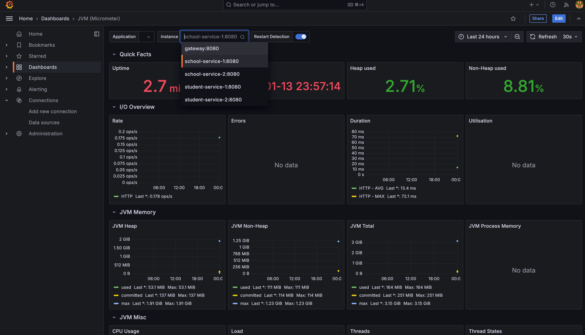

# 🎓 School Project Microservices

> Microservices project for school, using Spring Boot, Consul, Grafana, Prometheus and Docker.

# 🚧 Installation

`brew install consul`
`consul agent -dev`

# 🧩 Features 

- [x] Service Discovery
- [x] Load Balancing
- [x] Circuit Breaker
- [x] Gateway
- [x] Monitoring and Logging

# 🚀 Grafana Dashboard

### 🌐 Gateway Panel

### 💻 Service Panel

